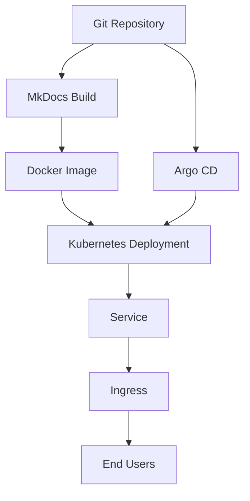

# This Application

This MkDocs Material documentation site serves as a practical example of GitOps in action.

## 🏗️ Application Architecture



## 📁 Project Structure

```text
skynet-example-app/
├── mkdocs.yml           # MkDocs configuration
├── requirements.txt     # Python dependencies
├── Dockerfile          # Container image definition
├── docs/               # Documentation source
│   ├── index.md        # Homepage
│   ├── gitops/         # GitOps documentation
│   ├── infrastructure/ # Infrastructure docs
│   └── examples/       # Examples and tutorials
├── k8s/               # Kubernetes manifests
│   ├── namespace.yaml  # Namespace definition
│   ├── deployment.yaml # Application deployment
│   ├── service.yaml    # Service definition
│   └── ingress.yaml    # Ingress configuration
└── argocd/            # Argo CD application
    └── application.yaml # Argo CD app definition
```

## 🐳 Containerization

The application is containerized using a multi-stage Docker build:

### Build Stage
- Uses Python 3.11 slim image
- Installs MkDocs and dependencies
- Builds static site

### Runtime Stage
- Uses nginx:alpine for serving
- Copies built site to nginx document root
- Lightweight and secure

```dockerfile
# Build stage
FROM python:3.11-slim as builder
WORKDIR /app
COPY requirements.txt .
RUN pip install --no-cache-dir -r requirements.txt
COPY . .
RUN mkdocs build

# Runtime stage
FROM nginx:alpine
COPY --from=builder /app/site /usr/share/nginx/html
EXPOSE 80
```

## ☸️ Kubernetes Deployment

### Namespace
Isolated namespace for the documentation application.

### Deployment
- Single replica (can be scaled)
- Resource limits for stability
- Health checks for reliability

### Service
- ClusterIP service for internal access
- Port 80 for HTTP traffic

### Ingress
- External access configuration
- SSL termination (when configured)
- Path-based routing

## 🔄 GitOps Flow

1. **Source Code**: Documentation written in Markdown
2. **Git Commit**: Changes pushed to main branch
3. **Argo CD Sync**: Detects changes and syncs
4. **Image Build**: CI/CD builds new container image
5. **Deployment**: Kubernetes deployment updated
6. **Service**: Traffic routed to new pods

## 🔧 Development Workflow

### Local Development
```bash
# Install dependencies
pip install -r requirements.txt

# Serve locally
mkdocs serve

# Build static site
mkdocs build
```

### Testing Changes
```bash
# Build container locally
docker build -t skynet-docs:local .

# Run container
docker run -p 8080:80 skynet-docs:local
```

### Deployment
```bash
# Commit changes
git add .
git commit -m "feat: update documentation"
git push origin main

# Argo CD will automatically sync changes
```

## 📊 Monitoring

### Health Checks
- **Liveness Probe**: Ensures container is running
- **Readiness Probe**: Ensures container is ready to serve traffic

### Metrics
- **Request Count**: Number of HTTP requests
- **Response Time**: Request latency
- **Error Rate**: 4xx/5xx responses

### Logging
- **Access Logs**: nginx access logs
- **Error Logs**: Application error logs
- **Audit Logs**: Git commit history

## 🚀 Scaling

The application can be horizontally scaled:

```yaml
spec:
  replicas: 3  # Scale to 3 replicas
```

### Considerations
- Static content serves well from multiple replicas
- No state to manage between replicas
- Load balancer distributes traffic

## 🔐 Security

### Container Security
- Non-root user in container
- Minimal base image (nginx:alpine)
- Regular security updates

### Kubernetes Security
- Network policies for isolation
- Resource quotas and limits
- RBAC for service accounts

### GitOps Security
- Git repository access controls
- Argo CD RBAC policies
- Encrypted secrets management
