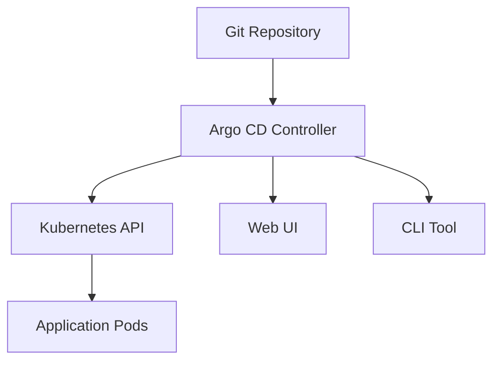

# Argo CD

Argo CD is a declarative, GitOps continuous delivery tool for Kubernetes.

## 🎯 What is Argo CD?

Argo CD is a Kubernetes controller that continuously monitors your applications and compares the current, live state against the desired target state (as specified in Git). It reports and visualizes the differences, while providing facilities to automatically or manually sync the live state back to the desired target state.

## 🏗️ Architecture

Argo CD follows the GitOps pattern of using Git repositories as the source of truth for defining the desired application state.



## 🚀 Key Features

### Automated Deployment
- Automatically deploys the desired application state to specified target environments
- Supports multiple config management tools (Helm, Kustomize, plain YAML)

### Git Integration
- Uses Git as the source of truth for application definitions
- Supports multiple Git providers (GitHub, GitLab, Bitbucket)

### Health Monitoring
- Continuously monitors application health and sync status
- Provides detailed insights into application state

### Multi-Cluster Support
- Can manage applications across multiple Kubernetes clusters
- Centralized management of distributed deployments

## 🔧 Core Concepts

### Application
A CRD (Custom Resource Definition) that represents a deployed application instance in an environment.

### Project
A logical grouping of applications, providing multi-tenancy features.

### Repository
A Git repository containing application manifests or Helm charts.

### Sync Policy
Defines how and when Argo CD should sync the Git repository with the cluster.

## 💻 Our Argo CD Setup

Our Argo CD instance is deployed on the Talos cluster and accessible at:
- **URL**: http://192.168.1.175:30080
- **Service Type**: NodePort
- **Namespace**: argocd

### Access Information
```bash
# Get admin password
kubectl -n argocd get secret argocd-initial-admin-secret -o jsonpath="{.data.password}" | base64 -d

# Port forward (alternative access)
kubectl port-forward svc/argocd-server -n argocd 8080:443
```

## 📖 Further Reading

- [Official Argo CD Documentation](https://argo-cd.readthedocs.io/)
- [GitOps Workflows](workflows.md) in practice
