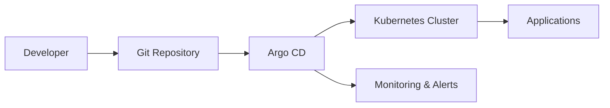

# GitOps Overview

GitOps is a modern approach to continuous deployment that uses Git as the single source of truth for declarative infrastructure and applications.

## 🔄 Core Principles

### 1. Declarative
Everything is described declaratively - the desired state of your system is versioned in Git.

### 2. Versioned and Immutable
All changes are tracked in version control, providing a complete audit trail.

### 3. Pulled Automatically
Software agents automatically pull the desired state declarations from Git.

### 4. Continuously Reconciled
Software agents continuously observe actual system state and attempt to apply the desired state.

## 🏗️ GitOps Architecture

## ✅ Benefits

- **Increased Productivity**: Developers can focus on code, not deployment
- **Enhanced Security**: No direct cluster access needed
- **Improved Reliability**: Automated rollbacks and consistent deployments
- **Better Compliance**: Complete audit trail of all changes
- **Faster Recovery**: Easy rollbacks to any previous state

## 🔧 Tools in the GitOps Ecosystem

- **Argo CD**: Declarative GitOps CD for Kubernetes
- **Flux**: GitOps toolkit for Kubernetes
- **Tekton**: Cloud-native CI/CD pipelines
- **Helm**: Package manager for Kubernetes

## 📚 Next Steps

- Learn about [Argo CD](argocd.md) specifically
- Explore [GitOps workflows](workflows.md) in practice
