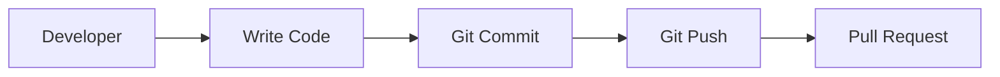
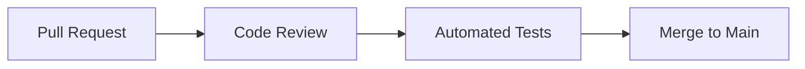
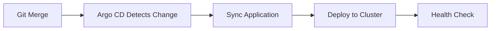

# GitOps Workflows

This page describes common GitOps workflows and how they apply to our platform.

## 🔄 Standard GitOps Workflow

### 1. Development Phase



### 2. Review & Merge



### 3. Deployment Phase



## 🚀 Application Deployment Workflow

### Configuration Changes
When you update Kubernetes manifests:

1. **Commit**: Push changes to Git repository
2. **Detection**: Argo CD polls Git repository (default: 3 minutes)
3. **Comparison**: Compares desired state (Git) vs current state (cluster)
4. **Sync**: Applies changes to bring cluster to desired state
5. **Verification**: Monitors health and reports status

### Rollback Workflow
If something goes wrong:

1. **Detection**: Argo CD or monitoring detects issues
2. **Rollback**: Either automatic or manual rollback to previous Git commit
3. **Verification**: Confirm system returns to healthy state

## 🎯 Example: This Documentation Site

This very documentation site follows GitOps principles:

```yaml
# Application definition in Argo CD
apiVersion: argoproj.io/v1alpha1
kind: Application
metadata:
  name: skynet-docs
  namespace: argocd
spec:
  source:
    repoURL: https://github.com/cyberdine-skynet/skynet-example-app
    targetRevision: main
    path: k8s
  destination:
    server: https://kubernetes.default.svc
    namespace: skynet-docs
  syncPolicy:
    automated:
      prune: true
      selfHeal: true
```

## 🔧 Sync Policies

### Manual Sync
- Changes require manual approval
- Good for production environments
- Higher control, slower deployment

### Automatic Sync
- Changes deploy automatically when detected
- Good for development/staging
- Faster deployment, less control

### Self-Healing
- Automatically corrects configuration drift
- Ensures cluster state matches Git
- Prevents manual cluster changes

## 📊 Monitoring & Observability

### Argo CD UI
- Visual representation of application state
- Sync status and health monitoring
- Detailed diff views

### Metrics & Alerts
- Prometheus metrics for GitOps processes
- Alerts for sync failures or drift
- Grafana dashboards for visualization

## 🛠️ Best Practices

### Repository Structure
```text
├── apps/                 # Application definitions
├── k8s/                 # Kubernetes manifests
│   ├── base/            # Base configurations
│   └── overlays/        # Environment-specific overlays
├── helm-charts/         # Helm charts
└── docs/               # Documentation
```

### Branching Strategy
- **main**: Production-ready code
- **develop**: Integration branch
- **feature/***: Feature development
- **hotfix/***: Emergency fixes

### Security Considerations
- Use Git webhooks for faster sync
- Implement RBAC for Argo CD access
- Secure Git repository access
- Regular backup of Argo CD configuration
