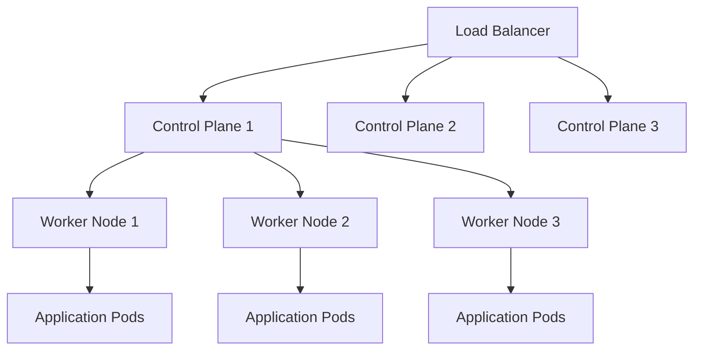

# Kubernetes Infrastructure

Our platform runs on a Talos-based Kubernetes cluster, providing a secure and minimal operating system designed specifically for Kubernetes.

## 🏗️ Cluster Architecture



## 🛡️ Talos Features

### Immutable Infrastructure
- Read-only root filesystem
- API-driven configuration
- No SSH access needed

### Security
- Minimal attack surface
- Built-in encryption
- Secure boot support

### Kubernetes Native
- Optimized for Kubernetes workloads
- Fast boot times
- Minimal resource overhead

## 📋 Cluster Information

| Component | Version | Notes |
|-----------|---------|-------|
| Kubernetes | 1.28+ | Latest stable |
| Talos | 1.5+ | Latest stable |
| CNI | Cilium | Network plugin |
| CSI | Local Path | Storage |

## 🔧 Common Operations

### Cluster Access
```bash
# Get cluster config
talosctl config endpoint <control-plane-ip>
talosctl kubeconfig ~/.kube/config

# Verify access
kubectl get nodes
```

### Node Management
```bash
# Check node status
talosctl health --nodes <node-ip>

# Upgrade node
talosctl upgrade --nodes <node-ip> --image <new-image>

# Reboot node
talosctl reboot --nodes <node-ip>
```

### Troubleshooting
```bash
# View logs
talosctl logs --nodes <node-ip>

# Access dashboard
talosctl dashboard --nodes <node-ip>

# Check services
talosctl services --nodes <node-ip>
```

## 🌐 Networking

### Pod Network
- **CIDR**: 10.244.0.0/16
- **Service CIDR**: 10.96.0.0/12
- **CNI**: Cilium with eBPF

### Ingress
- **Controller**: NGINX Ingress Controller
- **LoadBalancer**: MetalLB (if configured)
- **DNS**: CoreDNS

## 💾 Storage

### Persistent Volumes
- **CSI Driver**: Local Path Provisioner
- **Storage Class**: local-path (default)
- **Backup**: Velero (if configured)

### Example PVC
```yaml
apiVersion: v1
kind: PersistentVolumeClaim
metadata:
  name: my-pvc
spec:
  accessModes:
    - ReadWriteOnce
  storageClassName: local-path
  resources:
    requests:
      storage: 1Gi
```

## 🔍 Monitoring

### System Monitoring
- **Node Metrics**: Node Exporter
- **Cluster Metrics**: kube-state-metrics
- **Container Metrics**: cAdvisor

### Observability Stack
- **Metrics**: Prometheus
- **Visualization**: Grafana
- **Logging**: Loki (if configured)
- **Tracing**: Jaeger (if configured)

## 🚀 Best Practices

### Resource Management
```yaml
resources:
  requests:
    memory: "64Mi"
    cpu: "250m"
  limits:
    memory: "128Mi"
    cpu: "500m"
```

### Security
```yaml
securityContext:
  runAsNonRoot: true
  runAsUser: 1000
  allowPrivilegeEscalation: false
  readOnlyRootFilesystem: true
  capabilities:
    drop:
    - ALL
```

### Health Checks
```yaml
livenessProbe:
  httpGet:
    path: /health
    port: 8080
  initialDelaySeconds: 30
  periodSeconds: 10

readinessProbe:
  httpGet:
    path: /ready
    port: 8080
  initialDelaySeconds: 5
  periodSeconds: 5
```
